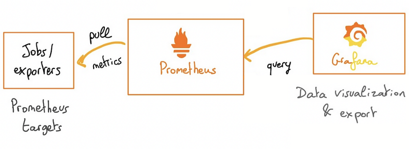
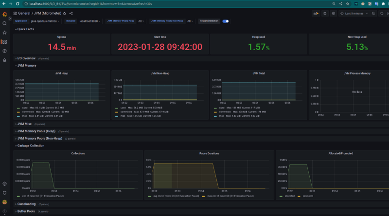
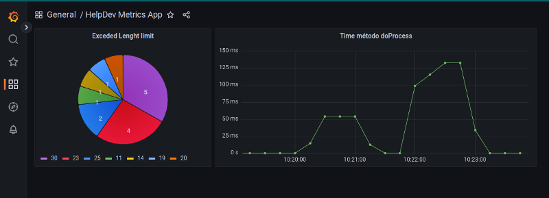

# Observability: Monitoring your application from metrics
<p align="center">
    
</p>
This repository contains sample Spring Boot and Quarkus application that exposes metrics to Prometheus and Grafana. 

The goal of this project was to showcase how to instrumentation your application and collect and monitor application's metrics running inside docker compose.

More detail in this article written in PT-BR: [Observabilidade: Monitorando sua aplicação a partir de métricas](https://medium.com/@guilherme.zarelli/observabilidade-monitorando-sua-aplica%C3%A7%C3%A3o-a-partir-de-m%C3%A9tricas-bd1b2d0ba1f8)

# Architecture

<p align="center">
    
</p>

The project contains the following components:

 - [Spring Boot Web Application](./java-spring-metrics): To export metrics
 - [Quarkus Web Application](./java-quarkus-metrics): To export metrics
 - [Prometheus](https://prometheus.io/): To collect metrics
 - [Grafana](https://grafana.com/): To data visualization

## Tecnologies:

 - Java 17
 - Spring Boot 3
 - Quarkus 2.15
 - Docker Compose
 - Prometheus 2.26
 - Grafana 9.3

# Execution

We have two docker-compose files to separate the stack and applications

- [docker/docker-compose-stack.yml](docker/docker-compose-stack.yml)
- [docker/docker-compose-apps.yml](docker/docker-compose-apps.yml)

To facilitate the execution of this example, we created a Makefile script with the following instructions:

- **build**: Execute build `mvnw clean install` on projects 
- **install**: Build the projects `Dockerfile`
- **run-stack**: Execute only `docker-compose-stack.yml`
- **run-apps**: Execute only `docker-compose-apps.yml`
- **run-all**: Execute all steps above
- **stop-stack**: Stop stack
- **stop-apps**:  Stop apps
- **stop-all**:  Stop stack and apps

Execute the desired instruction: 

```shellscript
$make {desired-instruction}
```

### Prometheus UI

- Running at: http://localhost:9090
- Config files: [docker/prometheus](./docker/prometheus/)

### Grafana UI

- Running at: http://localhost:3000
- Config files: [docker/grafana](./docker/grafana/)

### Test the apps métrics

Spring Boot: http://localhost:8081
Quarkus: http://localhost:8080

Both have a `/hello` endpoint with a Query Param `name` which will be metrified. The custom metrics generated are:

- `hello_get_method_timer`: Time metric about method duration
- `hello_get_do_process_timer`: Time metric about `doProcess` method duration
- `hello_get_name_length_limit`: Count metric increases when the Query Param `name` exceed the length limit (currently 10)

Call that endpoint:

```shelscript
$curl 'http://localhost:{port}/hello?name={any name}'
```

# Monitoring

We have Grafana as monitoring in conjunction with Prometheus listening to the metrics of the applications, a default dashbord was created that automatically goes up in Grafana; ([dashboards location](./docker/grafana/provisioning/dashboards/))

- JVM (Micrometer) Dashboard
<p align="center">
    
</p>

- Application Metrics Dashboard
<p align="center">
    
</p>

# Contribute

Pull Requests are welcome. For important changes, open an 'issue' first to discuss what you would like to change. Be sure to update tests as appropriate.

# Developer

**Guilherme Biff Zarelli**

Blog/Site - https://helpdev.com.br

LinkedIn - https://linkedin.com/in/gbzarelli/

GitHub - https://github.com/gbzarelli

Medium - https://medium.com/@guilherme.zarelli

Email - gbzarelli@helpdev.com.br
